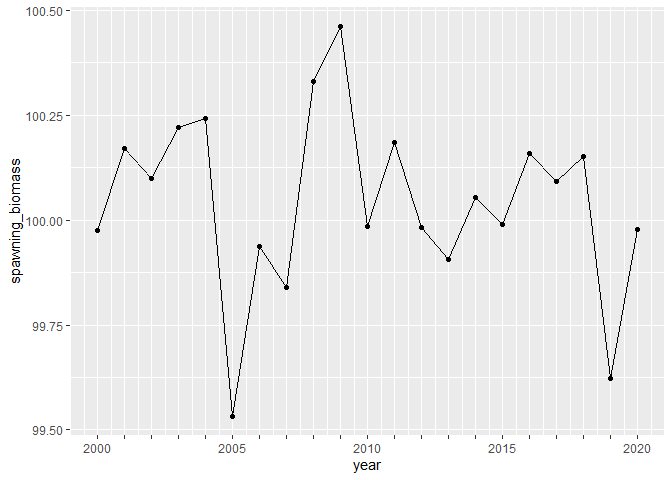
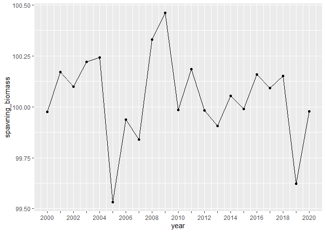
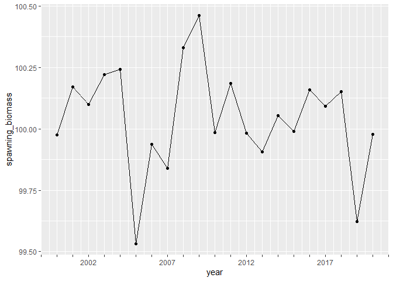
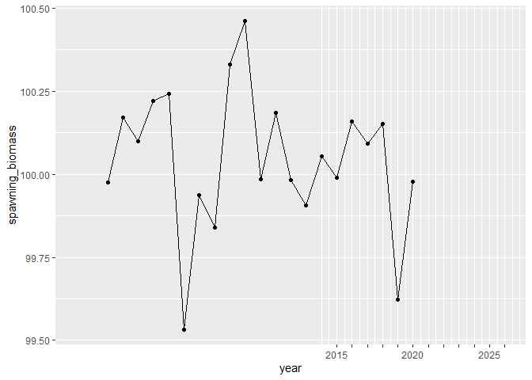
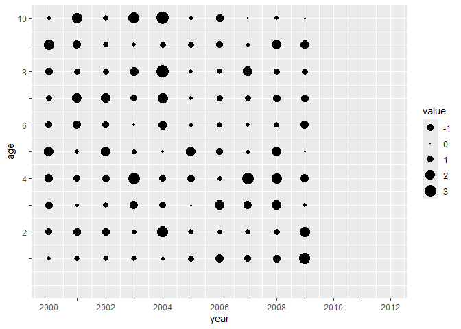

<!-- README.md is generated from README.Rmd. Please edit that file -->

# tickr

<!-- badges: start -->
<!-- badges: end -->

This is a small package to provide consistent tick marks for plotting
`ggplot2` figures. It provides breaks and labels for ggplot2 without
requiring ggplot2 to be installed.

## Installation

You can install the development version of `tickr` from GitHub:

``` r
# install.packages("remotes")
remotes::install_github("BenWilliams-NOAA/tickr")
```

## Example

``` r
library(tickr)
library(ggplot2)
library(dplyr)
#> 
#> Attaching package: 'dplyr'
#> The following objects are masked from 'package:stats':
#> 
#>     filter, lag
#> The following objects are masked from 'package:base':
#> 
#>     intersect, setdiff, setequal, union
```

Some basic examples of how to use the `tickr` package.

``` r
# Create a data.frame
df <- data.frame(year = 2000:2020,
                 spawning_biomass = rnorm(21,100, 0.25))

# explore tickr output
tickr(df, var=year)
#>    breaks labels
#> 1    2000   2000
#> 2    2001       
#> 3    2002       
#> 4    2003       
#> 5    2004       
#> 6    2005   2005
#> 7    2006       
#> 8    2007       
#> 9    2008       
#> 10   2009       
#> 11   2010   2010
#> 12   2011       
#> 13   2012       
#> 14   2013       
#> 15   2014       
#> 16   2015   2015
#> 17   2016       
#> 18   2017       
#> 19   2018       
#> 20   2019       
#> 21   2020   2020
tickr(df, var=year, by=2)
#>    breaks labels
#> 1    2000   2000
#> 2    2001       
#> 3    2002   2002
#> 4    2003       
#> 5    2004   2004
#> 6    2005       
#> 7    2006   2006
#> 8    2007       
#> 9    2008   2008
#> 10   2009       
#> 11   2010   2010
#> 12   2011       
#> 13   2012   2012
#> 14   2013       
#> 15   2014   2014
#> 16   2015       
#> 17   2016   2016
#> 18   2017       
#> 19   2018   2018
#> 20   2019       
#> 21   2020   2020
tickr(df, var=year, by=5, var_min = 1998, var_max = 2024, lab_start = 1998, lab_end = 2017)
#>    breaks labels
#> 1    1998   1998
#> 2    1999       
#> 3    2000       
#> 4    2001       
#> 5    2002       
#> 6    2003   2003
#> 7    2004       
#> 8    2005       
#> 9    2006       
#> 10   2007       
#> 11   2008   2008
#> 12   2009       
#> 13   2010       
#> 14   2011       
#> 15   2012       
#> 16   2013   2013
#> 17   2014       
#> 18   2015       
#> 19   2016       
#> 20   2017       
#> 21   2018       
#> 22   2019       
#> 23   2020       
#> 24   2021       
#> 25   2022       
#> 26   2023       
#> 27   2024
tickr(df, var=year, by=5, var_min = 1998, var_max = 2024, lab_start = 1998, lab_end = 2017)
#>    breaks labels
#> 1    1998   1998
#> 2    1999       
#> 3    2000       
#> 4    2001       
#> 5    2002       
#> 6    2003   2003
#> 7    2004       
#> 8    2005       
#> 9    2006       
#> 10   2007       
#> 11   2008   2008
#> 12   2009       
#> 13   2010       
#> 14   2011       
#> 15   2012       
#> 16   2013   2013
#> 17   2014       
#> 18   2015       
#> 19   2016       
#> 20   2017       
#> 21   2018       
#> 22   2019       
#> 23   2020       
#> 24   2021       
#> 25   2022       
#> 26   2023       
#> 27   2024

# explore plotting options
# default ggplot
ggplot(df, aes(year, spawning_biomass)) + 
  geom_line() +
  geom_point()
```


``` r

# a tick mark for every year
ggplot(df, aes(year, spawning_biomass)) + 
  geom_line() +
  geom_point() +
  scale_x_tickr(data=df, var=year)
```



``` r

# a tick mark for every year & label every 2nd year
ggplot(df, aes(year, spawning_biomass)) + 
  geom_line() +
  geom_point() +
  scale_x_tickr(data=df, var=year, by = 2)
```



``` r

# determine the years that are labeled
ggplot(df, aes(year, spawning_biomass)) + 
  geom_line() +
  geom_point() +
  scale_x_tickr(data=df, var=year, by = 5, 
                var_min = 1997, 
                var_max = 2024, 
                lab_start = 1997) 
```



``` r

# determine the years that are labeled
ggplot(df, aes(year, spawning_biomass)) + 
  geom_line() +
  geom_point() +
  scale_x_tickr(data=df, var=year, by = 2, 
                var_min = 2010, 
                lab_start = 2010)
```


``` r

# show future years
ggplot(df, aes(year, spawning_biomass)) + 
  geom_line() +
  geom_point() +
  scale_x_tickr(data=df, var=year, by = 5, 
                var_min = 2015, 
                var_max = 2026, 
                lab_start = 2015, 
                lab_end = 2026) +
  expand_limits(x = c(1998, 2026)) 
```



The same general approach is available for y axes as well.

``` r
df <- expand.grid(age = 1:10,
                 year = 2000:2009) %>% 
  dplyr::mutate(value = rnorm(100, 1, 1))

df %>% 
  ggplot(aes(year, age, size=value)) + 
  geom_point() +
  scale_size_area() +
  scale_x_tickr(data=df, var=year, by=2, var_max = 2012, lab_end = 2012) +
  scale_y_tickr(data=df, var=age, by=2) +
  expand_limits(y=0, x=2012)
```


